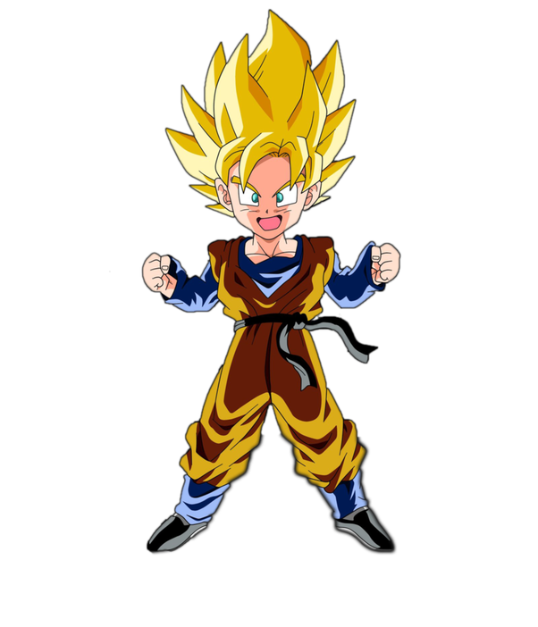

<p align="center">
    
</p>

# Goten

Goten is a tensor library written in Go with a neural network library built on top. It was just for fun.

## Installation

To install Goten, simply run:

```go
go get github.com/conacts/goten@latest
```

## Usage

Here is an example usage of Goten:

```go
package main

import (
	"fmt"
	"log"

	"github.com/conacts/goten/dataloader"
	"github.com/conacts/goten/engine"
	"github.com/conacts/goten/nn"
)

func main() {
	// hyper parameters
	lr := 0.0001
	net, err := nn.NewMLP([]int{2, 1})
	if err != nil {
		log.Fatalf("Failed to create new MLP: %v", err)
	}
	loss := nn.NewLoss(nn.LogLoss, nn.Backward)

	optimizer := nn.NewSGD(net.GetParameters(), lr)

	X, err := dataloader.LoadData("./data/xs.csv")
	if err != nil {
		log.Fatalf("Failed to load data: %v", err)
	}
	Y, err := dataloader.LoadData("./data/ys.csv")
	if err != nil {
		log.Fatalf("Failed to load data: %v", err)
	}

	Xs, err := dataloader.EncodeCSVToTensorList(X)
	if err != nil {
		log.Fatalf("Failed to encode CSV to tensor: %v", err)
	}
	Ys, err := dataloader.EncodeCSVToTensorList(Y)
	if err != nil {
		log.Fatalf("Failed to encode CSV to tensor: %v", err)
	}

	for i := 0; i < 100000; i++ {
		totaloutloss, _ := engine.NewZeroTensor([]int{1, 1})
		accuracy := 0.0
		net.ZeroGrad()
		for j := 0; j < len(Xs); j++ {
			out, err := net.Forward(Xs[j])
			if err != nil {
				log.Fatalf("Forward pass failed: %v", err)
			}
			out, err = engine.Sigmoid(out)
			if err != nil {
				log.Fatalf("Forward pass failed: %v", err)
			}

			// accuracy
			if out.GetData()[0] > .5 && Ys[j].GetData()[0] == 1. {
				accuracy += 1
			} else if out.GetData()[0] <= .5 && Ys[j].GetData()[0] == 0. {
				accuracy += 1
			}

			outloss, err := loss.Criterion(out, Ys[j])
			if err != nil {
				log.Fatalf("Loss computation failed: %v", err)
			}
			totaloutloss, _ = engine.Add(totaloutloss, outloss)

			// Backward pass
			dout, err := loss.Backward(out, Ys[j])
			if err != nil {
				log.Fatalf("Backward pass failed: %v", err)
			}
			net.Backward(dout)
		}
		if (i+1)%100 == 0 {
			fmt.Printf("Epoch: %d, accuracy: %.1f%%  loss: %.4f\n", i+1, accuracy, totaloutloss.GetData()[0]/float64(len(Xs)))
		}
		optimizer.Step()
		totaloutloss.SetData([]float64{0})
	}
}
```

## Test Package
```sh
git clone https://github.com/conacts/goten
cd goten
go run .
```

## Contributing

If you would like to contribute to goten, please open an issue or a pull request on the GitHub repository.
