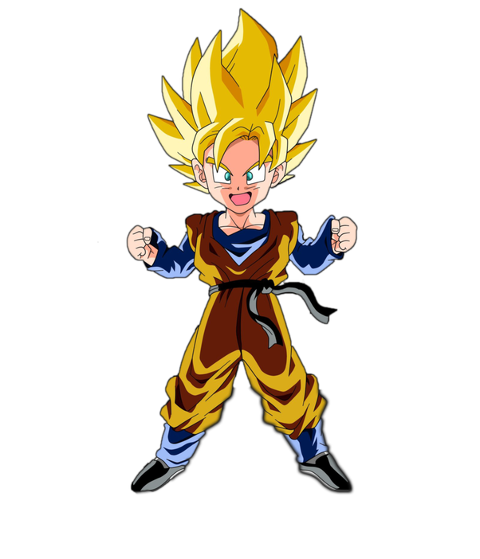

<p align="center">
    
</p>

# GoTen

Goten is a tensor library written in Go with a neural network library built on top. It is designed to be easy to use, performant, and suitable for a variety of machine learning and scientific computing tasks.

## Installation

To install GoTen, simply run:

```go
go get github.com/conacts/goten@latest
```

## Usage

GoTen can initialize a fully connected neural network in one line of code `net, err := nn.NewMLP([]int{2, 1})`

## Test Package

```sh
git clone https://github.com/conacts/goten
cd goten
go run .
```

## Contributing

If you would like to contribute to goten, please open an issue or a pull request on the GitHub repository.
